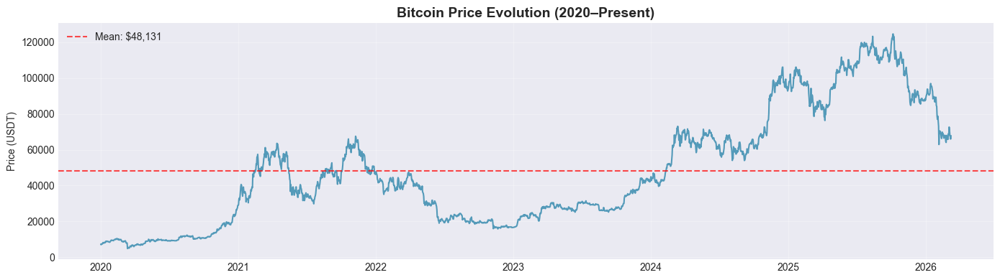
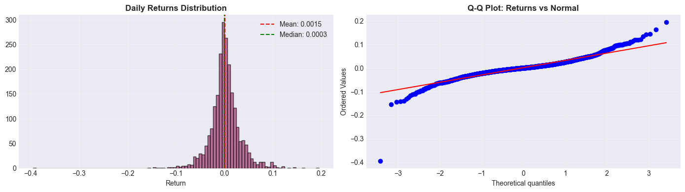
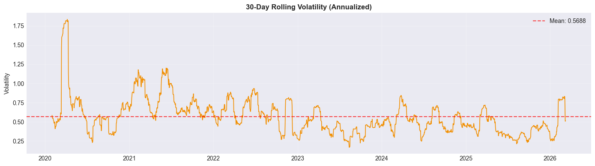

## Գլուխ 2. Տվյալների հավաքագրում և մշակում
## 2.1 Տվյալների աղբյուրները
Ցանկացած մեքենայական ուսուցման մոդելի հաջողությունը մեծապես կախված է ոչ միայն կիրառվող ալգորիթմի բարդությունից, այլ նաև տվյալների որակից ու բազմազանությունից։ Ֆինանսական կանխատեսման համատեքստում դա հատկապես կարևոր է, քանի որ շուկայի վարքագծի վրա ազդող գործոնները բազմազան են և փոխկախված, ու մեկ աղբյուրի տվյալներով ամբողջական պատկեր ստանալն անհնար է։ Հաշվի առնելով այս հանգամանքը՝ տվյալ աշխատանքում օգտագործվել են բազմակի աղբյուրներ, որոնցից յուրաքանչյուրը լրացուցիչ տեղեկատվություն է տրամադրում շուկայի դինամիկայի և ռիսկերի գնահատման համար։  
Աշխատանքի առաջին փուլում իրականացվել է Bitcoin կրիպտոարժույթի պատմական գնային տվյալների հավաքագրում անմիջապես առաջնային աղբյուրից։ Դրանք ներբեռնվել են Binance բորսայի պաշտոնական API-ի միջոցով՝ օրական ժամանակային ինտերվալով։ Ժամանակային հաճախականության ընտրությունը գիտակցված է. բարձր հաճախականության տվյալները (օրինակ՝ ժամային կամ րոպեական) պարունակում են զգալի քանակությամբ աղմուկ, որը պայմանավորված է կարճաժամկետ շուկայական հուզականությամբ և մանր կառուցվածքային տատանումներով։ Այդպիսի տվյալների օգտագործումը կարող է հանգեցնել մոդելի գերհարմարեցման (overfitting) և կանխատեսման անկայունության։  
Օրական միջակայքը թույլ է տալիս որոշ չափով մեղմել պատահական տատանումները և կենտրոնանալ կայուն շուկայական դինամիկայի վրա, ինչը հատկապես կարևոր է մեքենայական ուսուցման մոդելների կառուցման ժամանակ։ Հավաքագրված տվյալները ներառում են դասական OHLC կառուցվածքը՝ բացման գին (Open), առավելագույն գին (High), նվազագույն գին (Low), փակման գին (Close) և առևտրի ծավալ (Volume)։ Փակման (Close) գինն ավանդաբար համարվում է օրվա ամենակարևոր ցուցանիշը, քանի որ արտացոլում է շուկայի «վերջնական դատողությունը» տվյալ ժամանակահատվածի համար, սակայն ծավալի (Volume) ցուցանիշն ևս կրում է կարևոր տեղեկատվություն. կտրուկ գնային շարժումը մեծ ծավալի ուղեկցությամբ շատ ավելի հավաստի ազդանշան է, քան նույն շարժումը փոքր ծավալի դեպքում։  
Ուսումնասիրության ժամանակաշրջանը ընդգրկում է 2020 թվականի հունվարի 1-ից մինչև ներկայիս օրերը, ինչը հնարավորություն է տալիս վերլուծել ինչպես բարձր, այնպես էլ ցածր տատանողականության շրջաններ։ Այս բազմազանությունը անհրաժեշտ է մոդելի կայունությունը և ճշգրտությունը գնահատելու համար տարբեր շուկայական ռեժիմներում։ Տվյալները պահպանվել են մեկ կենտրոնացված ֆայլում՝ հետագա վերարտադրելիության և հաշվարկային կայունության ապահովման նպատակով, ինչը համարվում է գիտական հետազոտության կարևոր սկզբունք, քանի որ թույլ է տալիս ուսումնասիրությունը կրկնել նույն տվյալների հիման վրա՝ առանց արտաքին աղբյուրներից կախված լինելու։
Ֆինանսական շուկաների գների վրա ազդում են ոչ միայն տնտեսական ցուցանիշներ, այլ նաև ներդրողների հոգեբանությունն ու հուզական վիճակը։ Այս հանգամանքը հատկապես ցայտուն կերպով արտահայտվում է կրիպտոարժութային շուկայում, որտեղ ինստիտուցիոնալ ներդրողների կողքին ակտիվ դեր են խաղում անհատ ներդրողները, ովքեր հաճախ ավելի ենթակա են հուզական ազդեցությունների։  
&nbsp;&nbsp;&nbsp;&nbsp; Fear & Greed Index-ը (Վախի և ագահության ինդեքս) թվային ցուցանիշ է, որն արտահայտում է կրիպտոշուկայի ընդհանուր «տրամադրությունը» 0-ից 100 սանդղակով։ Ցուցանիշի ցածր արժեքները (0-ի մոտ) վկայում են ծայրահեղ վախի՝ ներդրողները վախենում են կորուստներից, դուրս են գալիս դիրքերից, ինչը սովորաբար ճնշող ազդեցություն է թողնում գների վրա։ Ցուցանիշի բարձր արժեքները (100-ի մոտ) արտացոլում են ծայրահեղ ագահություն, երբ ներդրողները ձգտում են արագ շահույթ ստանալ, շտապ գնումներ են կատարում, ինչը կարող է ազդարարել շուկայի գերգնման և հնարավոր շրջադարձի մասին։  
Ինդեքսը ձևավորվում է մի քանի բաղադրիչների համադրությամբ, ինչպիսիք են գների տատանողականությունը, սոցիալական ցանցերում Bitcoin-ի նկատմամբ ուշադրության ծավալը, ներդրողների հարցումների արդյունքները, ֆյուչերսային պայմանագրերի տվյալները և Bitcoin-ի գերիշխող դիրքը (dominance — Bitcoin-ի շուկայական կապիտալիզացիայի կշիռն ամբողջ կրիպտոշուկայի մեջ)։ Ինդեքսն ամենօրյա կտրվածքով հրապարակվում է Alternative.me կայքի կողմից, որտեղ հասանելի է նաև ամբողջ պատմական արխիվը։ Տվյալ աշխատանքում օգտագործված տվյալները ներբեռնվել են հենց այդ աղբյուրից՝ պաշտոնական API-ի միջոցով։  
Այս տեղեկատվությունը կարևոր է կանխատեսման մոդելների համար, քանի որ թույլ է տալիս հաշվի առնել շուկայի տրամադրությունը և դրա ազդեցությունը գների շարժումների վրա։  
&nbsp;&nbsp;&nbsp;&nbsp; Բացի դրանից աշխատանքում օգտագործվել է S&P 500-ը (Standard & Poor's 500) որը ամերիկյան ֆոնդային շուկայի ամենահայտնի ու ամենահեղինակավոր ցուցանիշն է, որն արտացոլում է ԱՄՆ-ի 500 ամենախոշոր հրապարակային ընկերությունների բաժնետոմսերի կշռված միջին արժեքը։ Այն ընդգրկում է Apple, Microsoft, Amazon, Google, JPMorgan Chase և այլ հսկա կորպորացիաներ, հետևաբար այն համարվում է ամերիկյան տնտեսության վիճակը բնութագրող հիմնական ցուցիչ և հաճախ օգտագործվում է որպես գլոբալ շուկայական միտումների չափանիշ։  
S&P 500-ի տվյալները ձեռք են բերվել yfinance Python գրադարանից, որը ավտոմատ կերպով ներբեռնում է հրապարակված տվյալները Yahoo Finance կայքից, որտեղ նրանք հավաքագրվում են տարբեր ամերիկյան բորսաներից (NYSE, NASDAQ և այլն)։  
S&P 500-ը հաճախ ծառայում է ներդրողների ռիսկ ընդունելու պատրաստակամության ցուցիչ․ երբ ֆոնդային շուկան ցուցաբերում է կայուն աճ, ներդրողները հակված են ավելի բարձր ռիսկային ակտիվներում ներդրումներ կատարել, ինչը սովորաբար դրական ազդեցություն է ունենում նաև կրիպտոշուկայի վրա։ Ընդհակառակը, S&P 500-ի կտրուկ անկման ժամանակաշրջաններում Bitcoin-ը նույնպես հաճախ ցուցաբերում է բացասական դինամիկա, ինչը վկայում է երկու շուկաների միջև առկա փոխկապակցվածության մասին։  
Հատկանշական է, որ 2020 թ. COVID-19-ի ճգնաժամի ժամանակ S&P 500-ի կտրուկ անկմանն զուգահեռ Bitcoin-ն ևս կտրուկ ընկավ, ապա 2020–2021 թթ. S&P 500-ի վերականգնմանը զուգընթաց Bitcoin-ն ևս արձանագրեց պատմական բարձր ռեկորդ։ Ֆոնդային շուկաներում կրիպտոարժույթների ինտեգրման աճով, հատկապես ինստիտուցիոնալ ներդրողների ընդլայնվող ներկայության հետ կապված, S&P 500-ի ազդեցությունը Bitcoin-ի վրա վերջին տարիներին ավելի ու ավելի ուժեղ է դարձել։ Հենց այս կապն է հիմնավորում S&P 500-ի ամենօրյա տվյալների ներառումը հետազոտության մեջ, քանի որ այն արտացոլում է մակրոտնտեսական միջավայրը, որը անուղղակիորեն, բայց կայուն կերպով ազդում է Bitcoin-ի շուկայի ուղղության վրա։  
&nbsp;&nbsp;&nbsp;&nbsp;Աշխատանքում օգտագործվել է նաև VIX-ը (Volatility Index — Տատանողականության ինդեքս), որը հաճախ անվանում են «վախի ինդեքս»։ Այն հաշվարկվում և հրապարակվում է Chicago Board Options Exchange(CBOE) ֆոնդային բորսայի կողմից և արտացոլում է S&P 500 ինդեքսի ակնկալվող տատանողականությունը առաջիկա 30 օրվա համար։
Տվյալ աշխատանքում VIX-ի արժեքները ստացվել են yfinance գրադարանի միջոցով՝ ապահովելով պատմական տվյալների հասանելիություն և ավտոմատ ներբեռնում։  
VIX-ը հաշվարկվում է S&P 500-ի օպցիոնների գների հիման վրա․ երբ շուկաներում անորոշությունն աճում է, ներդրողները ավելի հաճախ են դիմում պաշտպանական գործիքների, ինչի արդյունքում ինդեքսի արժեքը բարձրանում է։ Ֆինանսական պրակտիկայում VIX-ի 20-ից ցածր արժեքը սովորաբար համապատասխանում է հանգիստ, կայուն շուկայի, 20-30 տիրույթը՝ բարձր անորոշության, իսկ 30-ից բարձր արժեքն արտացոլում է կտրուկ անկայունություն։  
VIX-ի ներառումն այս հետազոտության մեջ բխում է հետևյալ դիտարկումից. Bitcoin-ի շուկան, չնայած իր ապակենտրոնացված բնույթին, մեկուսի չի գործում ավանդական ֆինանսական շուկաներից։ Հատկապես ճգնաժամային կամ բարձր անորոշության ժամանակաշրջաններում, երբ VIX-ն կտրուկ աճում է, ներդրողները հաճախ ձգտում են նվազեցնել ռիսկային ակտիվների (risk assets) ծավալը՝ ներառյալ կրիպտոարժույթները, ինչն ուղղակիորեն ազդում է Bitcoin-ի գների վրա։ Ուստի VIX-ն ապահովում է արտաքին, մակրոֆինանսական (macrofinancial — ամբողջ ֆինանսական համակարգի մակարդակին վերաբերող) ազդանշան, որն անմիջականորեն կապված է Bitcoin-ի ռեժիմային վարքագծի հետ, սակայն հնարավոր չէ ստանալ բացառապես Bitcoin-ի սեփական գնային տվյալներից։  
VIX-ի ներառումը տվյալ հետազոտության մեջ պայմանավորված է այն հանգամանքով, որ Bitcoin-ի շուկան, չնայած իր ապակենտրոնացված բնույթին, ամբողջությամբ մեկուսացված չէ ավանդական ֆինանսական շուկաներից։ Հատկապես բարձր անորոշության կամ ճգնաժամային իրավիճակներում, երբ VIX-ի արժեքը կտրուկ աճում է, ներդրողները հակված են նվազեցնել բարձր ռիսկ ունեցող ակտիվների բաժինը, այդ թվում՝ կրիպտոարժույթները, ինչը անմիջական ազդեցություն է ունենում Bitcoin-ի գնի դինամիկայի վրա։  
Այս տեսանկյունից VIX-ը հանդես է գալիս որպես արտաքին մակրոֆինանսական ցուցիչ, որը բնութագրում է շուկայի ընդհանուր ռիսկայնության մակարդակը։ Նման տեղեկատվությունը կարևոր է, քանի որ այն արտացոլում է շուկայի այնպիսի գործոններ, որոնք հնարավոր չէ գնահատել միայն Bitcoin-ի գնային տվյալների հիման վրա, սակայն ունեն նշանակալի ազդեցություն դրա վարքագծի վրա տարբեր շուկայական պայմաններում։
Այս լրացուցիչ տվյալները ավելացվում են Bitcoin-ի ժամանակային շարքին՝ որպես լրացուցիչ փոփոխականներ (features) մեքենայական ուսուցման մոդելների համար: Արդյունքում մոդելը ստանում է հնարավորություն ավելի ամբողջական գնահատել շուկայի ընդհանուր տրամադրությունը և ռիսկերը, այն չսահմանափակելով միայն ակտիվի գնային շարժումներով։  
## 2.2 Տվյալների նախնական մշակում
Տվյալների նախնական մշակումն առանցքային փուլ է ցանկացած մեքենայական ուսուցման նախագծի համար։ Տվյալների խոտորվածություն, անճշտություններ կամ բացակայող արժեքներ կարող են ուղղակիորեն նվազեցնել մոդելի ճշգրտությունը կամ հանգեցնել գերհարմարեցման (overfitting)։ Այս նպատակով իրականացվել է տվյալների նախնական մշակում և վավերացման գործընթաց, մի քանի հիմնական փուլերով։  
&nbsp; Առաջին փուլը վերաբերում է կրկնությունների հայտնաբերմանը: Ժամանակային շարքերում կրկնվող արժեքները կարող են առաջանալ տեխնիկական սխալների, API-ի խափանումների կամ տվյալների բազմակի ներբեռնման հետևանքով։ Այդպիսի կրկնություններ, եթե չբացառվեն, կարող են խեղաթյուրել մոդելի սովորելու գործընթացը՝ արհեստականորեն մեծացնելով որոշ օրերի ազդեցությունը կանխատեսման վրա։ Այդ պատճառով կրկնվող արժեքները հեռացվում են, ապահովելով, որ յուրաքանչյուր օրվա տեղեկատվությունը ներկայացվի միայն մեկ անգամ։  
&nbsp; Հաջորդ փուլում իրականացվում է OHLC (Open, High, Low, Close) արժեքների տրամաբանական ստուգում։ Շուկայական տվյալների տրամաբանությունը ենթադրում է, որ օրվա բարձրագույն գինը միշտ պետք է գերազանցի բացման և փակման գները, իսկ օրվա ցածրագույնը պետք է համապատասխանաբար փոքր լինի։ Նմանատիպ անհամապատասխանությունները սովորաբար տեխնիկական սխալների կամ տվյալների մատակարարման ընդհատումների հետևանք են:  Օգտագործելով ստանդարտ մեթոդներ, High և Low արժեքները կարգավորվում են՝ համապատասխանեցնելով բացման և փակման գներին, ինչը ստեղծում է տվյալների տրամաբանական ճշգրտություն։  
Այս աշխատանքում օգտագործվել է պարզ և արդյունավետ մեթոդ՝ ամենաբարձր և ամենացածր գիների ճշգրտում։ Յուրաքանչյուր օրվա համար այն իրականացվել է հետևյալ կերպ.  
Օրվա ամենաբարձր գինը նորից հաշվարկվում է՝ հաշվի առնելով օրվա բացման գինը, փակման գինը և սկզբնական ամենաբարձր գինը։ Այս ձևով, եթե ամենաբարձր գինը տեխնիկական սխալի կամ տվյալների աղբյուրի խնդիրների պատճառով փոքր էր, քան բացման կամ փակման գինը, այն ուղղվում է և դառնում իրատեսական՝ իրական շուկայի ամենաբարձր գինը տվյալ օրը։ Նույն ձև իրականացվում է ամենացածր գնի հաշվարկը։
Այս պարզ և տրամաբանական մոտեցումը ստեղծում է տվյալների շարքում համակարգված և շուկայի տրամաբանությանը համապատասխան OHLC արժեքներ, ինչը կարևոր է հետագա վերլուծությունների և մոդելավորման ճշգրտության համար։  
&nbsp; Տվյալների հաջորդ կարևոր փուլը օրվա բացակայող արժեքների հայտնաբերումն է։ Չնայած տվյալները հավաքագրվել են օրական համակարգով, որոշ օրերին հնարավոր է, որ տվյալները բացակայում են՝ տեխնիկական խնդիրների, տոնական օրերի կամ ուշացման պատճառով։ Այս բացակայությունները հայտնաբերվում են, և որոշ աշխատանքներում կարող է կիրառվել լրացման կամ ուղղման մեթոդ, սակայն այս հետազոտության շրջանակում բացակայող օրերը թողնվել են առանց միջամտության՝ կանխելու ոչ իրատեսական տվյալների ներդրումը մոդելում։  
Եթե տվյալների շարքում հայտնաբերված արժեքները դատարկ թողնվեն, դա չի հանգեցնում համակարգի խափանմանը կամ սխալ հաշվարկների, քանի որ մոդելը հաշվի է առնում միայն հասանելի, իրական արժեքները։ Միաժամանակ, համակարգը տրամադրում է հաղորդագրություններ կամ հաշվետվություն, որտեղ ցուցադրվում է բացակայող արժեքների քանակը և դրանց համապատասխան ամսաթվերը։ Այս մոտեցումը թույլ է տալիս վերլուծել տվյալների ամբողջականությունը, վերահսկել հնարավոր բացեր, և միաժամանակ ապահովում է, որ մոդելը աշխատի միայն վստահելի, իսկապես առկա տվյալների հիման վրա։  
Այնուամենայնիվ ստուգումը ցույց է տվել, որ դիտարկվող ժամանակահատվածում օրական բացեր չեն հայտնաբերվել։
&nbsp; Մյուս կարևոր քայլը տվյալների տոկոսային փոփոխությունների հաշվարկն է (returns), որը հիմնված է օրվա փակման գների փոփոխության վրա։ Տոկսային փոփոխությունների հաշվարկը թույլ է տալիս վերլուծել գների ուղղությունը և չափը, անկախ այլ ցուցանիշներից։ Սա կարևոր է ֆինանսական կանխատեսման մոդելներում, քանի որ մոդելի հիմնական նպատակն է ոչ միայն գների հետագա մակարդակների կանխատեսումը, այլ նաև դրանց շարժման չափի, փոփոխականության և ռիսկերի գնահատումը։  
Դրա համար յուրաքանչյուր օրվա փակման գինը համեմատվել է նախորդ օրվա փակման գնի հետ, ինչի արդյունքում ստացվել է թվային հաջորդականություն, որը ցույց է տալիս տվյալ օրվա գնային շարժը նախորդ օրվա համեմատ։
&nbsp; Արտաքին ազդանշանների վավերացման գործընթացն առանձնահատուկ ուշադրության է արժանի, քանի որ սրանք, ի տարբերություն կրիպտոարժույթների շուկայի, հաճախ գործում են սահմանափակ ժամանակային ռեժիմով կամ ունեն տվյալների տրամադրման այլ պարբերականություն։ Այս փուլի հիմնական նպատակն է ապահովել տվյալների ամբողջականությունն ու տրամաբանական համապատասխանությունը դիտարկվող ժամանակահատվածի յուրաքանչյուր օրվա համար։ Գործընթացը սկսվում է յուրաքանչյուր ազդանշանի առկայության ստուգմամբ, որտեղ բացակայող արժեքների հայտնաբերման դեպքում կիրառվում են լրացման տարբերակված մոտեցումներ։   
Մասնավորապես, Fear & Greed ինդեքսի կամ նմանատիպ այլ ցուցանիշների դեպքում բացը լրացվում է վերջին հայտնի արժեքի հիման վրա, սակայն սահմանվում է առավելագույնը երկօրյա սահմանափակում՝ հնացած կամ ոչ արդիական տեղեկատվության ներմուծումից խուսափելու համար։ Ավելի երկարատև բացակայության դեպքում համակարգն ավտոմատ կերպով տրամադրում է ազդանշան և համապատասխան հաշվետվություն, ինչը թույլ է տալիս հետազոտողին կայացնել հիմնավորված որոշում տվյալների հետագա մշակման կամ բացթողման վերաբերյալ։  
S&P 500 ինդեքսի դեպքում մոտեցումն արմատապես տարբերվում է, քանի որ մոդելավորման համար օգտագործվում է ոչ թե գնային բացարձակ մակարդակը, այլ օրական գնային փոփոխությունը(returns)։ Այն օրերին, երբ ֆոնդային բորսան փակ է, այդ օրվա համար գրանցված փոփոխությունը սահմանվում է զրոյական։ Սա հիմնավորվում է այն մաթեմատիկական իրողությամբ, որ շուկայի փակ լինելու պայմաններում գնային շարժ տեղի չի ունենում, հետևաբար նախորդ օրվա համեմատ արժեքի որևէ տոկոսային տատանում չի արձանագրվում։ Նման մոտեցումը թույլ է տալիս ապահովել տվյալների շարունակականությունը՝ առանց մոդելի մեջ արհեստական աղմուկ կամ կեղծ ենթադրություններ ներմուծելու։  
VIX-ի դեպքում, որը չափում է շուկայի փոփոխականությունը, բացակայող արժեքները լրացվում են վերջին հասանելի չափման հիման վրա, բայց առավելագույնը երեք օրվա համար։ Այս ընտրությունը հիմնված է այն փաստի վրա, որ VIX-ը համեմատաբար դանդաղ փոխվող ցուցանիշ է, ուստի կարճաժամկետ լրացումները չեն խախտում շուկայի տրամաբանությունը, իսկ երկարաժամկետ բացակայությունը կարող է ազդել մոդելի ճշգրտության վրա։ Եթե լրացման անհրաժեշտությունը գերազանցում է սահմանված օրերի քանակը, համակարգը անմիջապես ազդանշան է ուղարկում՝ նշելով բացակայող ամսաթվերը, որպեսզի հետազոտողը ստույգ կարողանա որոշել՝ ինչպես վարվել այդ տվյալների հետ։  
Այսպիսով, տվյալների նախնական մշակման և վավերացման բազմաշերտ համակարգը երաշխավորում է ներմուծվող փոփոխականների բարձր որակն ու հավաստիությունը։ Յուրաքանչյուր ցուցանիշի համար ընտրված լրացման և ուղղման առանձնահատուկ մեթոդները թույլ են տալիս հաղթահարել ավանդական և կրիպտոարժույթների շուկաների ժամանակային անհամապատասխանությունները՝ պահպանելով տվյալների շարքի կառուցվածքային ամբողջականությունը։ Ստեղծված մաքուր և տրամաբանորեն վավերացված տվյալների հենքը հուսալի հիմք է հանդիսանում մոդելի հետագա ուսուցման համար՝ նվազեցնելով կեղծ ազդանշանների հավանականությունը և բարձրացնելով կանխատեսումների ճշգրտությունը փոփոխական շուկայական պայմաններում։

## 2.3 Տվյալների հետազոտական և վիճակագրական վերլուծություն
Տվյալների նախնական մշակումից հետո անհրաժեշտ է իրականացնել խորացված հետազոտական վերլուծություն (Exploratory Data Analysis — EDA), որի նպատակն է բացահայտել ժամանակային շարքի վիճակագրական հատկությունները, բաշխման առանձնահատկությունները և շուկայական դինամիկայի ներքին օրինաչափությունները։ Ֆինանսական տվյալների դեպքում սա պարզապես վիզուալիզացիա չէ, այլ մաթեմատիկական հիմնավորում, թե ինչու են ավանդական գծային մոդելները հաճախ ձախողվում և ինչու է անհրաժեշտ անցում կատարել մեքենայական ուսուցման ալգորիթմներին։  

<i>Նկար 1. Բիթքոյնի գնային փոփոխությունների դինամիկան</i>

Bitcoin-ի գնային դինամիկայի ($P_t$) դիտարկումը 2020-2026թթ. ժամանակահատվածում ցույց է տալիս, որ շարքը հանդիսանում է ոչ ստացիոնար գործընթաց: Սա նշանակում է, որ ժամանակի ընթացքում շարքի մաթեմատիկական սպասումը և վարիացիա փոփոխական են, այսինքն գնային շարքն ունի բարձրացող երկարաժամկետ միտում (trend) ինչը դժվարացնում է ուղղակի կանխատեսումների իրականացումը:    
Ոչ ստացիոնար շարքի անմիջական կիրառությունը կանխատեսող մոդելներում հանգեցնում է «կեղծ ռեգրեսիայի» (spurious regression) երևույթի, երբ մոդելն արձանագրում է վիճակագրորեն նշանակալի կախվածություններ, որոնք փաստացի գոյություն չունեն, այլ ծագում են ժամանակային շարքի ոչ ստացիոնար կառուցվածքից։  
Այս հանգամանքը պահանջում է ժամանակային շարքի վերափոխում։ Ֆինանսական վերլուծության ընդունված մոտեցմամբ, $P_t$-ի փոխարեն կիրառվում են լոգարիթմական հարաբերական փոփոխություններ (log returns), որոնք մաթեմատիկորեն սահմանվում են հետևյալ կերպ.  

$$\Large r_t = \ln\left(\frac{P_t}{P_{t-1}}\right) = \ln(P_t) - \ln(P_{t-1})$$

Այս ձևակերպումն ունի մի շարք կարևոր մաթեմատիկական առավելություններ։ Նախ, լոգարիթմական փոփոխություններն ունեն ադիտիվության հատկություն, այսինքն k ժամանակահատվածի կուտակային փոփոխությունը հավասար է առանձին ժամանակահատվածների գումարին.  

$$\Large r_{t,t+k} = \sum_{i=0}^{k-1} r_{t+i}$$
Քանի որ լոգարիթմական ֆունկցիան $f(x) = \ln(x)$ սահմանված է բացառապես $x \in (0, +\infty)$ տիրույթում, այն համապատասխանում է ֆինանսական ակտիվների գնային հատկություններին։ Գները, լինելով միշտ դրական մեծություններ ($P_t > 0$), թույլ են տալիս իրականացնել այս ձևափոխությունը առանց տվյալների լրացուցիչ զտման կամ արհեստական սահմանափակումների։ Սա ապահովում է հաշվարկների մաթեմատիկական անընդհատությունը և ճշգրտությունը ամբողջ դիտարկվող ժամանակահատվածում։  
Երրորդ կարևոր առանձնահատկությունն այն է, որ $r_t$​-ն ներկայացնում է գնային շարքի հարաբերական փոփոխությունների վրա հիմնված ձև։ Ի տարբերություն բացարձակ գնային փոփոխությունների ($\Delta P_t = P_t - P_{t-1}$), լոգարիթմական ձևափոխությունը վերացնում է գների մակարդակի ազդեցությունը վերլուծության վրա։ Մաթեմատիկորեն սա նշանակում է, որ հավասարաչափ տոկոսային փոփոխությունները տարբեր գնային մակարդակներում (օրինակ՝ գնի աճը 100-ից 110-ի և 100,000-ից 110,000-ի) դիտարկվում են որպես նույնական վիճակագրական իրադարձություններ։ Սա թույլ է տալիս մոդելին կենտրոնանալ ոչ թե ակտիվի անվանական արժեքի, այլ շուկայական դինամիկայի և հարաբերական տատանումների վրա։    
Այսպիսով ֆինանսական գների շարքերը սովորաբար ունենում են հստակ արտահայտված երկարաժամկետ ուղղություն (աճող կամ նվազող միտում), ինչը խանգարում է տվյալների ստացիոնարությանը։ Լոգարիթմական հարաբերական փոփոխություններին անցնելը թույլ է տալիս ուղղել շարքը այդ սխալներից։ Արդյունքում՝ մենք ստանում ենք մի շարք, որը տատանվում է զրոյական միջինի շուրջ։ Սա չափազանց կարևոր է մեքենայական ուսուցման մոդելների համար, քանի որ ալգորիթմն ավելի հեշտ է սովորում կանխատեսել տատանումների օրինաչափությունները, երբ տվյալները կայուն են և չունեն բարձրացող երկարաժամկետ միտում (trend)։  
Հետազոտական վերլուծության գլխավոր հարցն է. արդյո՞ք Bitcoin-ի $r_t$-ն ենթարկվում է նորմալ (Գաուսյան) բաշխման N(μ, σ²) օրենքին, ինչպես ենթադրում են ֆինանսական շուկաների դասական մոդելները, թե՞ ոչ։ Այս հարցին պատասխանելու համար կիրառվում է բաշխման բարձր կարգի կենտրոնական մոմենտների վերլուծություն։

<i>Նկար 2. Լոգարիթմական փոփոխությունների բաշխումը (ձախ) և Q-Q գծապատկերը (աջ)</i>

Ստացված տվյալների բաշխման ձևը (Նկ. 2, ձախ) ցույց է տալիս, որ r_t-ի ճնշող մեծամասնությունը կենտրոնացած է զրոյի շուրջ, սակայն բաշխման ծայրերում դիտվում է բարձր հաճախականություն, այսինքն՝ ծայրահեղ արժեքները հանդիպում են ավելի հաճախ, քան դա սպասվում է նորմալ բաշխման դեպքում։  
Բաշխման ձևի ավելի մանրամասն բնութագրման համար դիտարկվում են երրորդ և չորրորդ կենտրոնական մոմենտները։ Երրորդ կենտրոնական մոմենտը, որն արտացոլում է բաշխման ասիմետրիան (skewness), սահմանվում է.

$$\Large\gamma_1 = \frac{E[(r_t - \mu)^3]}{\sigma^3}$$

Ստացված արժեքը՝ γ₁ = −0.54, ցույց է տալիս բաշխման ձախակողմյան ասիմետրիա, ինչը նշանակում է, որ կտրուկ բացասական շեղումները (անկման օրերը) ավելի ծայրահեղ են, քան համապատասխան դրական շեղումները։ Այլ կերպ ասած, Bitcoin-ի գներում արագ ու մեծ անկումները ավելի հաճախ են, քան մեծ և հանկարծակի աճերը, ինչը բնութագրական է մեծ ռիսկ ունեցող ֆինանսական ակտիվների համար։
Չորրորդ կենտրոնական մոմենտն արտահայտում է բաշխման ծայրայեղ արժեքների կուտակման ինտենսիվությունը (kurtosis).

$$\Large\gamma_2 = \frac{E[(r_t - \mu)^4]}{\sigma^4}$$

Նորմալ բաշխման դեպքում չորրորդ կենտրոնական մոմենտից ստացվող գործակիցը հավասար է 3-ի, ուստի վերլուծության մեջ դիտարկվում է դրա շեղումը այդ արժեքից՝ $\kappa = \gamma_2 - 3$: Bitcoin-ի $r_t$-ի համար ստացված է $\kappa \gg 0$, ինչը ցույց է տալիս, որ բաշխման ծայրամասերում հավանականությունները բարձր են։ Այսինքն՝ մեծ տատանումները տեղի են ունենում ավելի հաճախ, քան դա սպասվում է նորմալ բաշխման դեպքում։  

&nbsp;&nbsp;&nbsp; Այս հետևությունը հաստատվում է նաև Q-Q գծապատկերով (Նկ. 2, աջ), որտեղ ներկայացվում է r_t-ի էմպիրիկ արժեքների համեմատությունը տեսական նորմալ բաշխման համապատասխան արժեքների հետ։ Եթե r_t ճշգրիտ համապատասխանի նորմալ բաշխման, գծապատկերի կետերը կտեղավորվեին ուղիղ գծի վրա։ Փոխարենը, ինչպես երևում է Նկ. 2-ից, բաշխման երկու ծայրամասերում (−3 և +3 ստանդարտ շեղման հատվածներ) նկատվում է նշանակալի շեղում ուղիղ գծից, ինչը հաստատում է, որ բաշխման ծայրամասերում հավանականությունները իրականում ավելի բարձր են։  

&nbsp;&nbsp;&nbsp;Ֆինանսական ժամանակային շարքերի ուսումնասիրությունը թույլ է տալիս բացահայտել մի կարևոր օրինաչափություն. շուկայական տատանումների ինտենսիվությունը ժամանակի մեջ բաշխված է անհամաչափ։ Դիտարկումները ցույց են տալիս, որ բարձր անորոշության և գնային կտրուկ շարժերի ժամանակաշրջանները հակված են պահպանվելու և հաջորդելու միմյանց, ինչը վկայում է շուկայում տիրող իներցիոն վիճակների մասին։ Այս երևույթը մաթեմատիկորեն հիմնավորվել է դեռևս Բ. Մանդելբրոտի կողմից (1963թ.), ով փաստեց, որ թեև գների լոգարիթմական փոփոխությունները ($r_t$) օժտված չեն գծային կախվածությամբ, սակայն դրանց բացարձակ արժեքները ($|r_t|$) և քառակուսիները ($r_t^2$) ունեն զգալի ինքնակոռելյացիա։  Սա փաստում է, որ շուկայական ռիսկի մակարդակն ունի ժամանակային կախվածություն և հակված է պահպանել իր դինամիկան որոշակի միջակայքերում։ 

<i>Նկար 3. Առևտրի ծավալների և տատանողականության (volatility) փոխկապակցվածությունը</i>

Ծավալ-տատանողականության կապն էլ բավական հետաքրքիր է (Նկ. 3, ներքևի գծապատկեր) ապահովում է լրացուցիչ ախտորոշիչ տեղեկատվություն։ Մեծ ծավալի առևտրերն ու բարձր տատանումների ժամանակները հաճախ համընկնում են, ինչն ընդգծում է, որ շուկայի փոփոխություններն ազդում են նաև գնային դինամիկայի վրա։   
Այս կապը կարելի է բնութագրել հետևյալ կերպ՝ կովարիացիայի միջոցով.

$$\Large\text{Cov}(|r_t|, V_t) = \frac{1}{N-1} \sum_{i=0}^{N-1} \big(|r_{t-i}| - \overline{|r|}\big)\big(V_{t-i} - \bar{V}\big)$$

Որտեղ ՝ $V_t$ — տվյալ օրվա առևտրի ծավալն է , $|r_t|$ — նույն օրվա գնային փոփոխության չափը, $\overline{|r|}$, $\bar{V}$ — վերջին $N$ դիտարկումների միջին արժեքները:  
Օրինակ, 2022-2023թթ. FTX բորսայի փլուզման ժամանակահատվածում ծավալների ռեկորդային աճը համապատասխանում էր բարձր տատանողականության գագաթնակետերին ցույց տալով, որ ֆինանսական ճգնաժամերը կարող են առաջացնել անսովոր մեծ շուկայային փոփոխություններ։  

Ժամանակային շարքի կանխատեսելիությունը գնահատելու համար օգտագործվել է ինքնակոռելյացիայի գործակիցը (ACF), որը ցույց է տալիս, թե անցյալում տեղի ունեցած փոփոխությունները որքանով են ազդում ներկա արժեքների վրա։  

$$\Large\text{ACF}(k) = \frac{\sum_{t=1}^{N-k} (r_t - \bar{r})(r_{t+k} - \bar{r})}{\sum_{t=1}^{N} (r_t - \bar{r})^2}$$

Որտեղ ՝ $r_t$ — ժամանակային շարքի $t$-րդ դիտարկումն է, $\bar{r}$ — շարքի միջին արժեքն է , $k$ — տեղաշարժի (lag) քայլի թիվն է, $N$ տվյալների դիտարկումների ընդհանուր քանակն է:  
Bitcoin-ի $r_t$-ի դեպքում նկատվել է, որ ուղղակի ինքնակոռելյացիա գրեթե չկա՝ այսինքն՝ գծային կախվածություն չի դիտվել, ինչը համապատասխանում է արդյունավետ շուկայի սկզբունքներին։ Սակայն |r_t|-ի կամ r_t²-ի հետազոտությունը ցույց է տալիս ուժեղ ոչ գծային կախվածություններ, որը ապացուցում է ոչ գծային մոդելների օգտագործման անհրաժեշտությունը։  
Անհրաժեշտ է նաև նշել, որ $r_t$ շարքը ստացիոնար է, ինչպես հաստատվել է Դիքի-Ֆուլլերի (Augmented Dickey-Fuller — ADF) թեստով։
ADF թեստի հիմնական մոդելը գրեթե միշտ ներկայացվում է հետևյալ ձևով՝

$$\Large\Delta r_t = \alpha + \beta t + \gamma r_{t-1} + \sum_{i=1}^{p} \delta_i \Delta r_{t-i} + \varepsilon_t$$

Այս մոդելում օգտագործվող փոփոխականները և գործակիցները սահմանվում են հետևյալ կերպ.
$\Delta r_t = r_t - r_{t-1}$ – հանդիսանում է ընթացիկ արժեքի փոփոխությունը։  
$\alpha$ – հաստատուն արժեք է, որը, ելնելով ֆինանսական շարքերից, արտացոլում է միջին օրական փոփոխությունը։  
$\beta t$ – բաղադրիչը ավելացվում է այն դեպքում, երբ ցանկանում ենք հաշվի առնել հնարավոր ժամանակային միտումը (*trend*)։ Այն ցույց է տալիս, թե ինչպես է շարքը ժամանակի ընթացքում աճում կամ նվազում. Եթե $\beta > 0$, շարքը ժամանակի ընթացքում ունի կայուն աճի միտում։ Եթե $\beta < 0$, ապա այն ցուցաբերում է նվազման միտում։ $r_{t-1}$– մեկ քայլ(lag) առաջվա արժեքն է։  
$\gamma$ (Test Statistic) – հանդիսանում է թեստի ամենակարևոր գործակիցը, քանի որ ցույց է տալիս կապը նախորդ արժեքի ($r_{t-1}$) և ընթացիկ փոփոխության միջև։ Ստացիոնար շարքերի համար $\gamma$ սովորաբար բացասական է ($\gamma < 0$)։ Եթե $\gamma = 0$, սա նշանակում է, որ շարքը ոչ ստացիոնար է։ Որքան $\gamma$-ն հեռու է զրոյից դեպի բացասական տիրույթ, այնքան ուժեղ է շարքի՝ դեպի միջին արժեք վերադառնալու հատկությունը։   
$\delta_i$ – ցույց է տալիս, թե նախորդ ժամանակաշրջանի փոփոխությունը որքանով է ազդում ներկայի վերադարձի վրա։
$p$ – ամբողջ թիվ է, որը նշում է, թե քանի նախորդ քայլ է ներառված մոդելում։ $p$-ի ճիշտ ընտրությունը թույլ է տալիս մոդելից հեռացնել ավելորդ կախվածությունները և ստանալ մաքուր արդյունք։  
$\varepsilon_t$ – մոդելի մնացորդային սխալն է, որը արտացոլում է այն տարրերը, որոնք չեն բացատրվել մոդելով։    

Հետազոտության արդյունքները ցույց տվեցին, որ հաշվարկված վիճակագրական ցուցանիշը (Statistic = -22.87) զգալիորեն փոքր է կրիտիկական արժեքներից, իսկ p-value-ն հավասար է 0.00: Սա թույլ է տալիս վստահորեն հերքել ոչ ստացիոնարության վարկածը և եզրակացնել, որ լոգարիթմական հարաբերական փոփոխությունների շարքը պիտանի է հետագա մաթեմատիկական մոդելավորման և կանխատեսողական ալգորիթմների ուսուցման համար:  

Վերջին կարևոր հետազոտական հարցն այն է, թե ինչի կհասնի մոդելը, եթե այն որևէ ուսուցում չի ստացել և պարզապես ամեն անգամ կանխատեսի ամենահաճախ հանդիպող ուղղությունը (naive baseline): Ընդհանուր 2,261 դիտարկման հիման վրա պարզվել է, որ աճի օրերը ($r_t > 0$) կազմում են 1,261՝ մոտ 55.77%, անկման օրերը ($r_t < 0$)՝ 994՝ 43.96%, իսկ չեզոք օրերը ($r_t = 0$) գրեթե աննշան են՝ 6 օր կամ 0.27%:  
Եթե baseline մոդելը միշտ կանխատեսի «աճ», ապա դրա ճշգրտությունը կլինի 55.77%։ Այս ցուցանիշը կարևոր ուղենիշ է (benchmark), քանի որ ցանկացած մոդել, որը չի գերազանցում այս մակարդակը, արժեք չունի, քանի որ նույնիսկ առանց ուսուցման կարելի է ստանալ նույնքան կամ ավելի լավ արդյունք:  
Միևնույն ժամանակ, ուղղությունների ոչ հավասարաչափ բաշխումը (55.77% աճ  43.96% անկում) ցույց է տալիս դասերի անհավասարակշռություն (class imbalance)։ Սա անպայման հաշվի է առնվում մոդելի ուսուցման փուլում՝ օգտագործելով, օրինակ, կշիռներ (weight) և F1 ցուցանիշ՝ ճշգրտության (accuracy) փոխարեն, ինչը մանրամասն կբացատրվի հաջորդ Գլուխում:  

Ամփոփելով, EDA-ի արդյունքները ցույց են տալիս, որ Bitcoin-ի վերադարձների (rtr_trt​) ժամանակային շարքը ունի ստացիոնար բնույթ, բայց համատեղում է մի շարք համալիր առանձնահատկություններ՝ ոչ Գաուսյան բաշխում (ասիմետրիա և ծանր պոչեր), ոչ գծային ժամանակային կախվածություններ, տատանողականության ռեժիմային փոփոխություններ և դասերի անհավասարակշռություն: Այս հավաքական հատկանիշները կարևոր են այն մաթեմատիկական հիմքը ստեղծելու համար, որի վրա կառուցվում են ինչպես ավանդական, այնպես էլ ոչ գծային և ռեժիմին ինտեգրված կանխատեսման մոդելները, որոնք մանրամասն ներկայացվում են հաջորդ գլխում:  